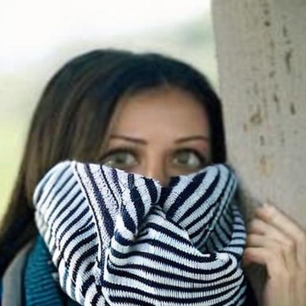

# 🔍 VISBENCH-3: Benchmarking MLLMs on Fine-Grained Visual Reasoning Tasks


<p align="left">
  
  
  
  
  
  
  
  
  
  
</p>


VISBENCH-3 is a curated benchmark for evaluating **Multimodal Large Language Models (MLLMs)** on fine-grained, real-world vision tasks:

* 👯‍♀️ **Twin Face Verification**
* 🥸 **Disguise Detection**
* 🐾 **Wildlife Species Recognition (Night-vision IR)**

---

## ✨ Key Features

* ✅ Evaluated **Qwen2.5-VL**, **LLaMA-4 Maverick**, **LLaMA-4 Scout**
* 📊 Measured using **Accuracy**, **F1 Score**, and **Robustness**
* 🧠 Architectural summaries for each MLLM
* 📦 Open-source inference & evaluation code

---

## 🧠 MLLM Architectures

### 🔹 Qwen2.5-VL ([72B Instruct](https://huggingface.co/Qwen/Qwen2.5-VL-72B-Instruct))

* Developed by Alibaba
* Transformer decoder with **token-level vision-text fusion**
* Vision encoder + projector feeds into the language model

### 🔸 LLaMA-4 Maverick ([17B 128E Instruct FP8](https://huggingface.co/meta-llama/Llama-4-Maverick-17B-128E-Instruct-FP8))

* Open-weight LLM from Meta
* Dual-encoder fusion (vision & text)
* Optimized for **instruction-tuned multimodal tasks**

### 🔸 LLaMA-4 Scout ([17B 16E Instruct](https://huggingface.co/meta-llama/Llama-4-Scout-17B-16E-Instruct))

* Instruction-tuned visual reasoning model
* Attention over image patches + text tokens
* Excels at **binary classification** tasks

---

## 📊 Evaluation Summary

### 🔹 Dataset Difficulty Ranking

> Higher F1 = Easier. Twin is easier than Disguise and Wildlife.

### 🔹 Overall Radar Plot

> LLaMA-Scout leads across most tasks and metrics.

### 🔹 F1 Score Summary Table

> **Best average F1:** LLaMA-Scout (0.6032)

### 🔹 Best Model Per Dataset

> Scout wins 2 out of 3 tasks.

---

## 🧪 Dataset Tasks

| Task     | Description                                  |
| -------- | -------------------------------------------- |
| Twin     | Classify whether face pairs are real twins   |
| Disguise | Detect if an image is a disguised variant    |
| Wildlife | Classify animal species from IR night-vision |

---


## 🖼️ Disguise Dataset Samples

<p float="left">
  
  
  
  
</p>

> Above: One original face and three disguised variants showing makeup, occlusion, and facial distortion.

---

## 🖼️ Twin Dataset Samples

<p float="left">
  
  
</p>

> Above: Sample twin verification pair — real twin siblings used in binary classification task.

---

## 🖼️ Wildlife Dataset Samples

<p float="left">
  
  
  
  
</p>

> Above: Wildlife task samples captured using infrared night-vision camera traps, featuring a weasel under varying environmental conditions.

---

## 🔁 Inference Example (via HuggingFace Hub)

```python
from huggingface_hub import InferenceClient

client = InferenceClient()
completion = client.chat.completions.create(
    model="deepseek-ai/DeepSeek-V3-0324",
    messages=[{"role": "user", "content": "How many 'G's in 'huggingface'?"}],
)
print(completion.choices[0].message)
```

---

## 📁 Repository Structure

```
├── assets/        # 📊 Evaluation plots
├── data/          # 📂 Task-specific datasets
├── notebooks/     # 📓 Per-model evaluation
├── src/           # 🧠 Core benchmark logic
└── README.md      # 📘 This file
```

---
## 🌱 Future Directions

* Benchmark more MLLMs across a wider range of tasks to enable task-specific model selection
* Group tasks by reasoning category (e.g., verification, classification, matching) to support cost-effective deployment decisions
* Add **video QA**, **multi-turn vision chat**, **distribution shift** testsAdd **video QA**, **multi-turn vision chat**, **distribution shift** tests
* Integrate **human-in-the-loop validation**
* Expand to **low-resource or cross-lingual vision tasks**

---

## 👨‍💼 Authors

* **Nikunj Drolia** — UCD MSc, Data & Computational Science
* **Shiven Singh** — UCD MSc, Data & Computational Science

---

## 📄 License

Released under the MIT License. See [LICENSE](./LICENSE) for details.

---

## 📝 Citation

````bibtex
@inproceedings{agarwal-etal-2025-mvtamperbench,
  title     = {{MVT}amper{B}ench: Evaluating Robustness of Vision-Language Models},
  author    = {Amit Agarwal and Srikant Panda and Angeline Charles and Hitesh Laxmichand Patel and Bhargava Kumar and Priyaranjan Pattnayak and Taki Hasan Rafi and Tejaswini Kumar and Hansa Meghwani and Karan Gupta and Dong-Kyu Chae},
  booktitle = {Findings of the Association for Computational Linguistics: ACL 2025},
  pages     = {18804--18828},
  year      = {2025},
  address   = {Vienna, Austria},
  publisher = {Association for Computational Linguistics},
  url       = {https://aclanthology.org/2025.findings-acl.963/}
}

@inproceedings{patel-etal-2025-sweeval,
  title     = {{SweEval}: Do {LLM}s Really Swear? A Safety Benchmark for Testing Limits for Enterprise Use},
  author    = {Hitesh L. Patel and Amit Agarwal and Arion Das and Bhargava Kumar and Srikant Panda and Priyaranjan Pattnayak and Taki Hasan Rafi and Tejaswini Kumar and Dong-Kyu Chae},
  booktitle = {Proceedings of the 2025 Conference of the North American Chapter of the Association for Computational Linguistics: Human Language Technologies (Industry Track)},
  pages     = {558--582},
  year      = {2025},
  address   = {Albuquerque, New Mexico},
  publisher = {Association for Computational Linguistics},
  url       = {https://aclanthology.org/2025.naacl-industry.46/},
  doi       = {10.18653/v1/2025.naacl-industry.46}
}
````
